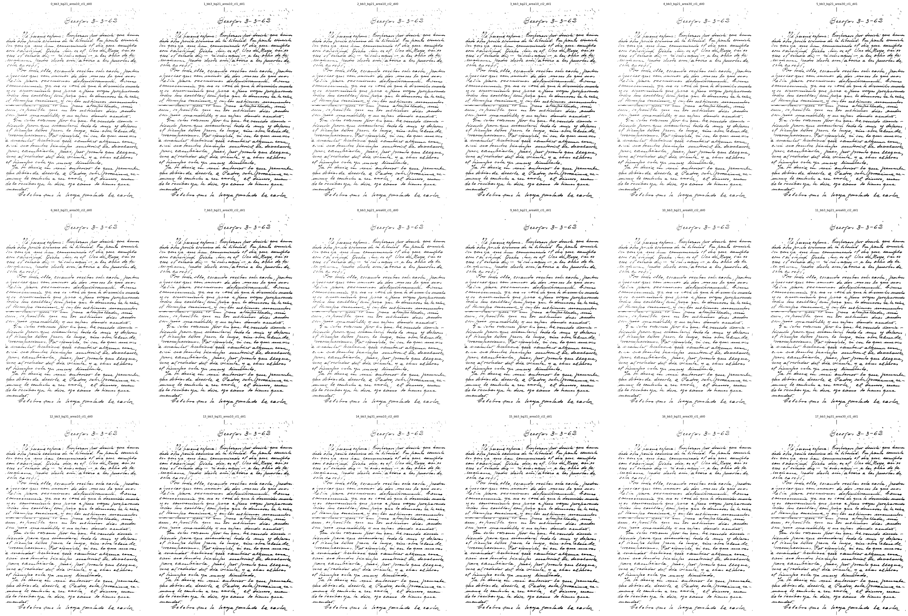
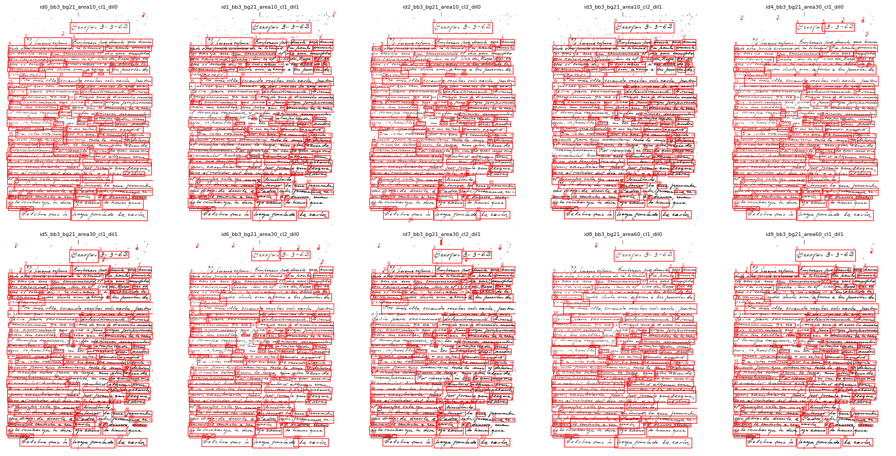

# 𝓛𝑒𝓉𝓉𝑒𝓇-𝓉𝑜-𝒯𝑒𝓍𝓉

**𝓛𝑒𝓉𝓉𝑒𝓇-𝓉𝑜-𝒯𝑒𝓍𝓉** is a research-oriented repository focused on building and evaluating pipelines for **handwritten Spanish letter transcription**.
The project explores traditional OCR-based workflows (detection + recognition) and LLM-based transcription through the OpenAI API.

The goal is to provide a modular experimentation environment that helps compare multiple approaches under the same conditions, measure their quality using standardized metrics (CER, WER, SER, Line-CER), and generate visual analyses through gridsearch experiments.

Three main pipeline families have been tested:

* **Fully traditional OCR**: preprocessing → line detection → text recognition
* **Hybrid**: preprocessing → LLM recognition
* **Direct**: raw image → LLM recognition

This is sample image used for experimentation:

  

## Pipeline steps

### Preprocessing

The preprocessing module applies transformations designed to normalize, denoise, and enhance handwriting before OCR or LLM inference.
The pipeline works as follows:

1. **Optional resizing**: The input image can be resized so that its longest side is at most a fixed maximum, preserving aspect ratio. This keeps resolution under control for OCR/LLM models.
2. **Text-mask estimation on the blue channel**: The RGB image is split into channels and the blue channel is smoothed (Gaussian blur) and background-flattened using a large median filter. An automatic Otsu threshold is then applied on this normalized blue channel to obtain a binary mask where text ≈ foreground and paper ≈ background.
3. **Noise removal and smoothing**: Small connected components below a minimum area are removed, and a morphological closing operation is applied to fill gaps and connect strokes, reducing background noise and bleed-through artifacts.
4. **Grayscale conversion and contrast normalization**: The original image is converted to grayscale. Optionally, histogram equalization is applied inside the text regions to normalize contrast and make strokes more legible.
5. **Morphological refinement and compositing**: The text mask is slightly dilated to better cover thin strokes. The final preprocessed image is built by keeping the enhanced grayscale values where the mask indicates text and setting the background to white, then converting back to RGB.

A **visual gridsearch** is provided to compare preprocessing combinations.
See the tutorial: **[Preprocessing Gridsearch](docs/prepro_gs.md)**.

  

### OCR-based Transcription

For execution details, see the
**[OCR Inference Tutorial](docs/execute_inference.md#OCR-Inference)**.

#### Detection

The **PaddleOCR** detection module is used to localize text regions within the handwritten letter images.
`paddleocr.PaddleOCR` provides a high-performance combination of differentiable binarization (DB) detectors and CRNN-style recognition heads, optimized for multilingual document analysis and complex layouts. In our pipeline, we use its **text detection component** to extract bounding boxes for individual lines or text areas before recognition.

1. **Detection model:** `paddleocr.PaddleOCR`
   Official documentation: [https://github.com/PaddlePaddle/PaddleOCR](https://github.com/PaddlePaddle/PaddleOCR)
2. A configurable **detection gridsearch** is included to visually compare thresholds, DB parameters, and post-processing settings.
   See: **[Detection Gridsearch](docs/detection_gs.md)**.

  

#### Recognition

For text recognition, experiments primarily use the 🤗 [**qantev/trocr-large-spanish**](https://huggingface.co/qantev/trocr-large-spanish) model.
This model is a Spanish-specialized version of Microsoft’s TrOCR architecture, combining a ViT encoder for visual understanding with a GPT-2-style decoder for autoregressive text generation. Its Spanish-centric fine-tuning makes it particularly effective for handwritten and printed Spanish documents.

Other recognition or document-understanding models can be plugged into the pipeline with minimal code changes:

* 🤗 [**microsoft/trocr-base-handwritten**](https://huggingface.co/microsoft/trocr-base-handwritten)
* 🤗 [**SCUT-DLVCLab/lilt-roberta-en-base**](https://huggingface.co/SCUT-DLVCLab/lilt-roberta-en-base) (raw or fine-tuned)
* 🤗 [**naver-clova-ix/donut-base-finetuned-cord-v2**](https://huggingface.co/naver-clova-ix/donut-base-finetuned-cord-v2) (raw or fine-tuned)
* 🤗 [**PaddlePaddle/PaddleOCR-VL**](https://huggingface.co/PaddlePaddle/PaddleOCR-VL) (raw or fine-tuned)

A step-by-step guide for fine-tuning the qantev/trocr-large-spanish recognition model is available here:
**[Finetune Recognition Tutorial](docs/finetune_recognition_model.md)**.

### LLM-based Transcription

This pipeline performs transcription using **OpenAI Vision models**, which allow **end-to-end handwriting recognition directly from the raw image**.
Unlike the OCR-based workflow, these models do not require explicit text detection, line segmentation, or classical preprocessing—recognition is handled holistically by the multimodal transformer.

For execution details, see the
**[LLM Inference Tutorial](docs/execute_inference.md#LLM-Inference)**.

### Validation

Evaluation uses standard text recognition metrics widely used in OCR and handwriting research. These metrics quantify transcription quality at different levels of granularity:

* **CER — Character Error Rate**:
  Measures the proportion of character-level errors between the predicted transcription and the ground truth.
  Computed as the Levenshtein distance (substitutions, insertions, deletions) divided by the total number of characters in the ground truth.
  CER is sensitive to small mistakes such as accents, punctuation, or missing letters, making it a fine-grained metric.

* **WER — Word Error Rate**:
  Similar to CER but applied at the word level.
  WER captures higher-level errors that affect semantic meaning, such as incorrect words, merged/split words, or missing words.
  It is the main metric typically prioritized in handwriting and OCR evaluation.

* **SER — Sentence Error Rate**:
  A stricter metric that measures the proportion of sentences (or lines/segments) that contain *any* error.
  Even a single incorrect character makes the entire sentence count as wrong.
  SER highlights robustness: low SER indicates that the system produces fully correct lines more consistently.

* **Line-CER — Line-wise Character Error Rate**:
  Computes CER independently for each line and then averages the results.
  This is useful for handwritten documents where line lengths vary significantly; it prevents long lines from dominating the global CER.
  Line-CER is particularly informative when evaluating detection + recognition pipelines in which line segmentation may introduce line-level inconsistencies.

For execution details, see the
**[Evaluation Tutorial](docs/execute_evaluation.md)**.

