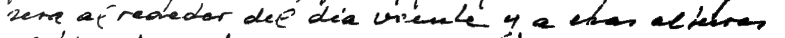

```py
from datasets import load_dataset, DatasetDict, Image
from transformers import (
    TrOCRProcessor,
    VisionEncoderDecoderModel,
    Seq2SeqTrainingArguments,
    Seq2SeqTrainer,
    default_data_collator,
)
import datasets
import torch
import os
from PIL import Image

exe_cuda = torch.cuda.is_available()

MODEL_NAME = "microsoft/trocr-base-handwritten"
MAX_TARGET_LENGTH = 64

CSV_PATH = "/content/drive/MyDrive/.../finetune_dataset.csv"
# CSV must have the following format:
#  image_path,text
#  /content/drive/MyDrive/.../line_images/line_0.png,"Burgos 3-3-62"
#  /content/drive/MyDrive/.../line_images/line_1.png,"Mi buena esposa: Empezare por decirte que hemos"
IMG_ROOT = "/content/drive/MyDrive/.../line_images"
# Line images in IMG_ROOT must be preprocessed
OUTPUT_DIR = "/content/drive/MyDrive/.../trocr-handwritten-finetuned"
```

```py
processor = TrOCRProcessor.from_pretrained(MODEL_NAME)
model = VisionEncoderDecoderModel.from_pretrained(MODEL_NAME)

model.config.decoder_start_token_id = processor.tokenizer.cls_token_id
model.config.pad_token_id = processor.tokenizer.pad_token_id
model.config.eos_token_id = processor.tokenizer.sep_token_id
model.config.vocab_size = model.config.decoder.vocab_size
```

```py
raw = load_dataset(
    "csv",
    data_files={"data": CSV_PATH},
)

# Split train-validation
splits = raw["data"].train_test_split(test_size=0.2, seed=42)
raw_datasets = DatasetDict({
    "train": splits["train"],
    "validation": splits["test"],
})
```

```py
def preprocess_batch(examples):
    paths = examples["image_path"]
    texts = examples["text"]

    images = []
    for p in paths:
        if IMG_ROOT is not None and not os.path.isabs(p):
            img_path = os.path.join(IMG_ROOT, p)
        else:
            img_path = p
        img = Image.open(img_path).convert("RGB")
        images.append(img)

    batch = processor(
        images=images,
        text=texts,
        padding="max_length",
        truncation=True,
        max_length=MAX_TARGET_LENGTH
    )

    pad_token_id = processor.tokenizer.pad_token_id
    new_labels = []
    for seq in batch["labels"]:
        new_labels.append([
            (token_id if token_id != pad_token_id else -100)
            for token_id in seq
        ])
    batch["labels"] = new_labels

    return batch
```

```py
processed_datasets = raw_datasets.map(
    preprocess_batch,
    batched=True,
    remove_columns=raw_datasets["train"].column_names
)

train_dataset = processed_datasets["train"]
eval_dataset = processed_datasets["validation"]
```

```py
training_args = Seq2SeqTrainingArguments(
    output_dir=OUTPUT_DIR,
    num_train_epochs=4,
    per_device_train_batch_size=4,
    per_device_eval_batch_size=4,
    learning_rate=1e-4,
    logging_steps=50,
    evaluation_strategy="epoch",
    save_strategy="epoch",
    predict_with_generate=True,
    fp16=exe_cuda,
    load_best_model_at_end=True,
    report_to="none"  # to avoid error "You must call wandb.init() before wandb.log()"
)

trainer = Seq2SeqTrainer(
    model=model,
    args=training_args,
    tokenizer=processor.tokenizer,
    train_dataset=train_dataset,
    eval_dataset=eval_dataset,
    data_collator=default_data_collator
)
```

```py
trainer.train()
trainer.save_model(OUTPUT_DIR)
processor.save_pretrained(OUTPUT_DIR)
```
```
======================================= [30/30 05:03, Epoch 5/5]
Epoch	Training Loss	Validation Loss
    1	       No log	       9.291096
    2	       No log	       7.296843
    3	       No log	       6.190670
    4	       No log	       5.902733
    5	       No log	       6.559987
```

## Infer finetuned model

```py
ckpt = OUTPUT_DIR
processor_ft = TrOCRProcessor.from_pretrained(ckpt)
model_ft = VisionEncoderDecoderModel.from_pretrained(ckpt).to("cuda" if exe_cuda else "cpu")
```

```py
test_image_path = f"{IMG_ROOT}/line_25.png"

image = Image.open(test_image_path).convert("RGB")
inputs = processor_ft(images=image, return_tensors="pt").to(model_ft.device)

with torch.no_grad():
    generated_ids = model_ft.generate(**inputs)

text = processor_ft.batch_decode(generated_ids, skip_special_tokens=True)[0]
print(text)
image
```
```
sera alrededor del dia veinte y a esas alturas
```

